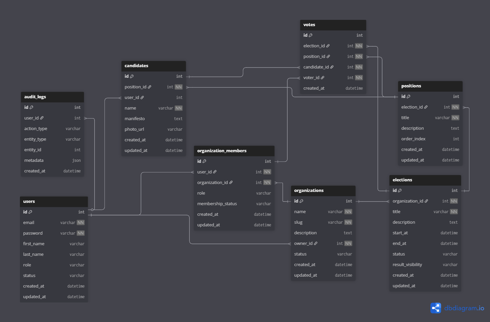

# **Online Polling System Backend**

This repository contains the backend implementation of an **Online Polling System** built as part of the **ProDev Backend Engineering Program**.  
 The system allows organizations to create polls/elections, register voters, manage candidates, and compute real-time results efficiently.

---

## **Project Overview**
The Online Polling System Backend is designed to support:
* **Poll/Election Management**  
* **User Registration & Authentication**  
* **Organization & Membership Workflow**  
* **Voting & Result Computation**  
* **Role-Based Access Control (RBAC)**  
* **Real-Time, Scalable Query Performance**

This backend is built using **Django \+ PostgreSQL**, with fully documented endpoints using **Swagger/OpenAPI**.

---

## **Project Objectives**
The primary goals of this backend system are:

### **✓ API Development**
* Create REST APIs for polls, candidates, users, and voting.  
* Allow organizations to create elections and manage voters.  
* Expose endpoints for real-time result computation.

### **✓ Database Efficiency**
* Normalize all tables to **3NF** to reduce redundancy.  
* Use optimized relational database design for scalable polls.  
* Enable fast result counting through efficient queries.

### **✓ Documentation**
* Provide full Swagger documentation at `/api/docs/`.

---

## **System Architecture**

### **Tech Stack**
| Technology | Purpose |
| ----- | ----- |
| **Python** | Core backend language |
| **Django** | Backend framework |
| **Django REST Framework (DRF)** | API development |
| **PostgreSQL** | Primary relational database |
| **Swagger / drf-yasg / drf-spectacular** | API documentation |
| **Docker (optional)** | Containerization |
| **Redis (optional)** | Caching & performance |

---

## **Key Features**

### **1\. Poll/Election Management**
* Create polls with multiple positions and candidates.  
* Set start and end times.  
* Add or remove options/candidates.  
* Manage organization configurations.

### **2\. User & Organization Workflow**
* Users can create accounts.  
* Organization admins can approve/reject membership requests.  
* Users can belong to multiple organizations.

### **3\. Voting System**
* Secure one-vote-per-position enforcement.  
* Anonymous vote storage.  
* Protection against duplicate voting.

### **4\. Real-Time Result Computation**
* Efficient queries to compute total votes per candidate.  
* Optional caching for high-traffic results endpoints.

### **5\. Swagger Documentation**
* Auto-generated API documentation available at:

`/api/docs/`

---

## **Entity Relationship Diagram (ERD)**



or provide your embedded link here:

[View ERD Diagram](https://www.dbdiagram.io/d/Online-Polling-System-691a294a6735e111700fd364)

---

## **Installation & Setup**

### **Clone the repository**
```bash
git clone https://github.com/Ken-Obieze/alx-project-nexus.git  
cd alx-project-nexus
```

### **Create and activate a virtual environment**
```bash
python -m venv venv  
source venv/bin/activate   # Linux/Mac
```
        or
```bash
venv\Scripts\activate      # Windows
```

### **Install dependencies**
```bash
pip install -r requirements.txt
```

### **Apply migrations**
```bash
python manage.py migrate`
```

### **Run the server**
```bash
python manage.py runserver`
```

---

## **API Documentation (Swagger)**

Once the server is running, access Swagger UI at:

`http://localhost:8000/api/docs/`

---

## **Testing**

Run the test suite:
```bash
python manage.py test
```
---

## **About the ProDev Backend Engineering Program**
This project was developed as part of the **ProDev Backend Engineering Program**, which focuses on real-world software engineering skills using modern backend tools and practices.

### **Major Learnings**

#### **Key Technologies**
* **Python & Django**  
* **Django REST Framework**  
* **GraphQL Fundamentals**  
* **Docker & Containerization**  
* **CI/CD (GitHub Actions)**

####  **Core Backend Concepts**
* Database Design & Normalization  
* REST API Standards  
* Caching Strategies  
* Asynchronous Programming  
* Authentication & Authorization  
* System Design & Architectural Planning

---

##  **Challenges & Solutions**

### **1\. Designing a Scalable Polling Database**

**Challenge:** Ensuring fast result computation even under heavy voting.  
 **Solution:**
* Normalized schema (3NF)  
* Indexed vote tables  
* Foreign-key optimized tables

### **2\. Preventing Duplicate Voting**

**Challenge:** Enforcing one vote per position.  
 **Solution:**
* Constraint enforcement  
* Backend validation  
* Atomic transactions

### **3\. Maintaining Role-Based Access**

**Challenge:** Multiple user types (Admin, Org Admin, Voter).  
 **Solution:**
* Custom permission classes in DRF  
* Token-based authentication

---

##  **Personal Takeaways**
* Better understanding of scalable API architecture.  
* Deepened experience with relational database design and constraints.  
* Stronger familiarity with Django REST best practices.  
* Improved proficiency with API documentation using Swagger.  
* Learned to manage complexity with clear modular design.

---

##  **License**
This project is licensed under MIT license.